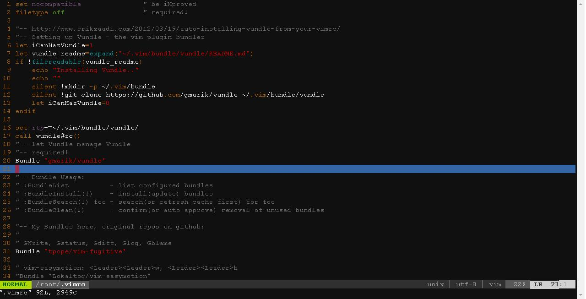

vimrc
------------
My vimrc setting for vim editor

Installation
------------
    cd /tmp
    git clone https://github.com/z-sean-huang/vimrc.git
    cd vimrc
    sh install.sh

Usage
-----
Please check the following link to get usage:
-   **[gmarik/vundle](https://github.com/gmarik/Vundle.vim)**
-   **[tpope/vim-fugitive](https://github.com/tpope/vim-fugitive)**
-   **[Lokaltog/vim-powerline](https://github.com/Lokaltog/vim-powerline)**
-   **[airblade/vim-gitgutter](https://github.com/airblade/vim-gitgutter)**
-   **[kien/ctrlp.vim](https://github.com/kien/ctrlp.vim)**
-   **[scrooloose/nerdtree](https://github.com/scrooloose/nerdtree)**
